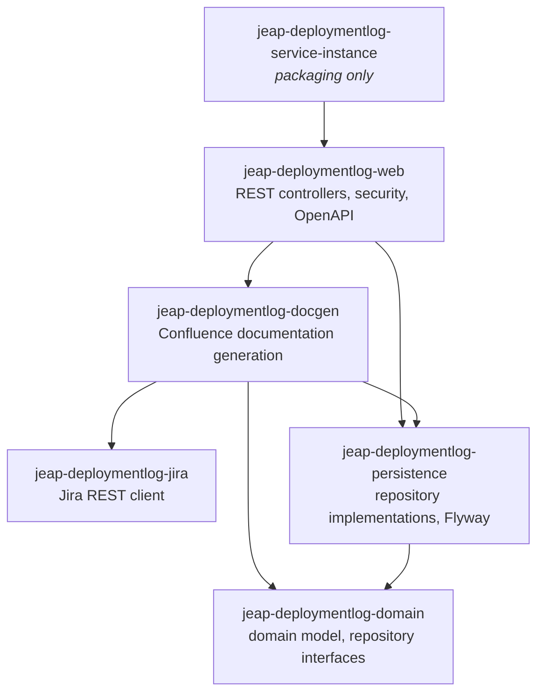
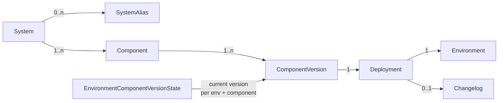
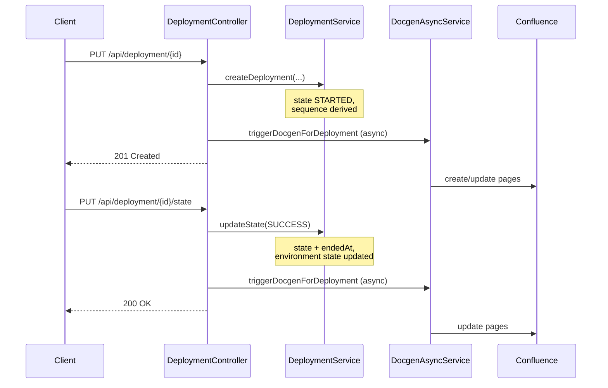

# Architecture

The Deployment Log Service traces the deployments of components onto environments and documents them as
Confluence pages. It is published as a library; the runnable artefact is an instance built by a downstream
project, see [Getting Started](getting-started.md).

## Building blocks

The library consists of six Maven modules layered so that every module only depends downwards:

| Module                            | Contains                                                                                                                                                   |
|-----------------------------------|------------------------------------------------------------------------------------------------------------------------------------------------------------|
| `jeap-deploymentlog-domain`       | The domain model and the repository *interfaces*. The domain classes are at the same time the JPA entities — there is one model, not a separate persistence model. |
| `jeap-deploymentlog-persistence`  | The repository *implementations* (`XxxRepositoryImpl` delegating to a Spring Data `JpaXxxRepository`) and the Flyway migrations in `db/migration`.          |
| `jeap-deploymentlog-jira`         | A standalone Jira REST client with retry. It has no dependency on the domain or the persistence layer.                                                     |
| `jeap-deploymentlog-docgen`       | The documentation generation: Thymeleaf rendering, the Confluence adapter, the async service and the scheduled jobs.                                       |
| `jeap-deploymentlog-web`          | The REST controllers and their DTOs, the API security configuration, the OpenAPI configuration and the Spring Boot application class.                       |
| `jeap-deploymentlog-service-instance` | A POM-only module bundling `jeap-deploymentlog-web`, meant to be used as the Maven parent of a service instance.                                        |

Every module contributes a Spring Boot `@AutoConfiguration` (`DomainConfiguration`,
`PersistenceConfiguration`, `JiraWebClientConfig`, `DocumentationGeneratorConfig`, `DeploymentLogConfig`),
so an instance only has to add the dependency and the configuration.

## Domain model

- **`Deployment`** is the central aggregate. It is identified towards clients by a client-chosen
  `externalId` and carries a `DeploymentState` (`STARTED`, `SUCCESS`, `FAILURE`, `CANCELLED`), a
  `DeploymentSequence`, an optional `DeploymentTarget` (type/url/details), a required `DeploymentUnit`
  (type/coordinates/artifactRepositoryUrl), free-form `links` and `properties`, and an optional changelog.
- **`DeploymentSequence`** classifies a deployment relative to what was on the environment before:
  `FIRST` (first deployment of the component onto the environment), `NEW` (a new version), `REPEATED`
  (the same version again) or `UNDEPLOYED` (the component was removed). It is derived by the service, not
  sent by the client.
- **`DeploymentType`** (`CODE`, `CONFIG`, `INFRASTRUCTURE`) marks what a deployment changed. A deployment
  may carry several types.
- **`System`, `Component`, `Environment`** are created on the fly when a deployment references them for
  the first time. Environment names are upper-cased. A system can be renamed (keeping the old name as a
  `SystemAlias`) or merged into another system.
- **`EnvironmentComponentVersionState`** holds the current state of an environment: which version of which
  component is deployed there. It is updated when a deployment is reported as `SUCCESS`, and it is what the
  system and environment query endpoints read.
- **`ArtifactVersion` and `Reference`** link a deployment back to the build that produced the artefact.
  They can be published before the deployment happens and are resolved at page-generation time — via the
  deployment-unit coordinates for artifact versions, and via the reference identifiers of the deployment
  for references.
- **Page entities** (`DeploymentPage`, `DeploymentListPage`, `SystemPage`, `EnvironmentHistoryPage`) record
  which Confluence page was generated for which entity and when. They are what makes the generation
  idempotent and repairable.

## Recording a deployment

Recording a deployment is a two-step protocol, because the outcome is only known when the deployment has
finished:

Both calls are **idempotent** in the sense that matters for a retrying client: a `PUT` on a deployment
whose `externalId` already exists returns `200 OK` and changes nothing, instead of creating a duplicate.

Only `SUCCESS`, `FAILURE` and `CANCELLED` are accepted as a state update; the environment state is only
advanced on `SUCCESS`.

Triggering the documentation generation is deliberately outside the transaction and outside the response:
if it fails, the failure is logged and the deployment stays recorded — the scheduled repair job picks the
page up later.

## Asynchrony and locking

The service uses no messaging. All asynchronous work is plain Spring `@Async` on a dedicated
`ThreadPoolTaskExecutor` (`asyncThreadpoolDocgenExecutor`, core pool 1, max 10 threads, queue 512),
with the tracing context propagated to the worker thread.

Two levels of locking keep concurrent generation runs apart:

- **Per-system docgen lock** (`DocgenLocks`) — a ShedLock lock named `docgen-<systemname>` serialises all
  generation runs for one system, across instances. A run waits up to three minutes for the lock; if it
  cannot acquire it, the task is skipped and left to the scheduled repair job. The lock is kept alive
  while the run is in progress (`KeepAliveLockProvider`), so a long run retrying Confluence updates does
  not lose it.
- **Scheduled job locks** — the cron jobs carry their own `@SchedulerLock`, so only one instance runs them
  at a time.

ShedLock uses a JDBC lock provider on the service's own datasource.

## Cross-cutting concepts

- **Security** — the `/api/**` endpoints are secured with HTTP basic authentication against two in-memory
  users configured by property, mapped to the roles `deploymentlog-read` and `deploymentlog-write`. The
  filter chain is stateless and CSRF is disabled. `GET /api/deployment-doc/**` is explicitly public.
  See [REST API](rest-api.md#security).
- **Error handling** — `RestResponseExceptionHandler` maps the domain exceptions onto HTTP status codes
  (not-found exceptions to `404`, already-defined/invalid-state exceptions to `400`, Jira unavailability to
  `503`) and passes errors of synchronously called upstream systems through with their original status.
- **Resilience** — the Confluence adapter retries on request failures (four attempts, exponential backoff)
  and re-renders the page content before retrying an update rejected as a conflict. The Jira client retries
  with an exponential backoff too.
- **Read replica** — read-only endpoints and queries are annotated with `@TransactionalReadReplica`
  (`jeap-spring-boot-tx`), so an instance configured with a read replica routes them there.
- **Observability** — the jEAP monitoring starter provides the actuator endpoints; the service adds its own
  metrics for the generation lag, generation errors and generation timings, see
  [Operations](operations.md#metrics).

## Related

- [Getting Started](getting-started.md)
- [Configuration](configuration.md)
- [REST API](rest-api.md)
- [Documentation Generation](documentation-generation.md)
- [Operations](operations.md)
