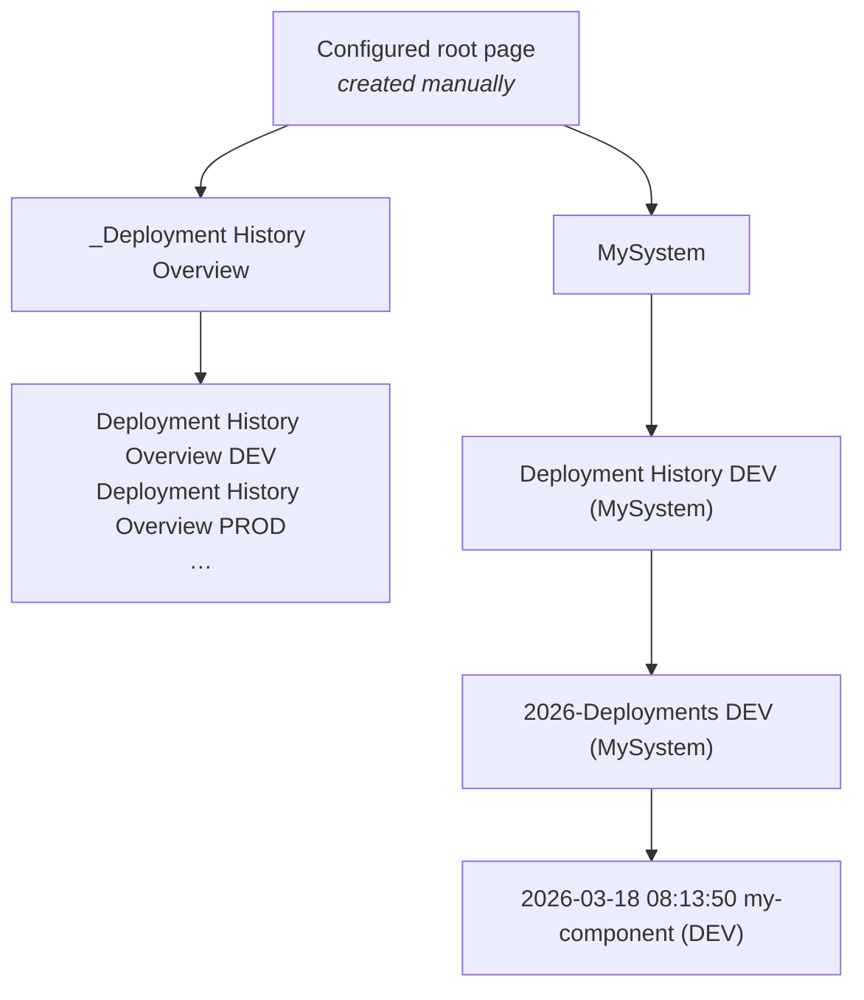
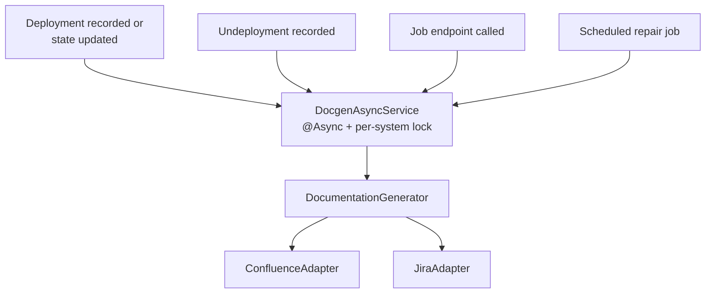

# Documentation Generation

Every recorded deployment is documented as a Confluence page. The Deployment Log Service owns the whole page
tree below the configured root page: it creates, updates, moves and deletes those pages, so manual edits are
overwritten. Restrict the write permission on that tree to the technical user of the service.

## The generated page tree

| Page                          | Title pattern                                       | Content                                                                                                                             |
|-------------------------------|-----------------------------------------------------|---------------------------------------------------------------------------------------------------------------------------------------|
| System page                   | `<SystemName>`                                      | One row per component, one column per environment, showing the deployed version, when it was deployed and a link to the deployment page. Differences between the environments are highlighted, see below. |
| Deployment history            | `Deployment History <ENV> (<SystemName>)`           | The most recent deployments of one system onto one environment, at most `deployment-history-max-show`.                              |
| Deployment list               | `<year>-Deployments <ENV> (<SystemName>)`           | Container page grouping the deployment pages of one year; the deployment pages are its children.                                     |
| Deployment page               | `<yyyy-MM-dd HH:mm:ss> <componentName> (<ENV>)`     | One deployment in detail, see below.                                                                                                |
| Undeployment page             | same, plus the suffix ` (Undeploy)`                 | The removal of a component from an environment.                                                                                     |
| Deployment history overview   | `Deployment History Overview <ENV>`, below `_Deployment History Overview` | The recent deployments of **all** systems onto one environment, limited to `deployment-history-overview-max-time` and `deployment-history-max-show`. |

Only the root page is created manually; everything else including the `_Deployment History Overview`
container is generated. The pages are rendered from Thymeleaf templates in `jeap-deploymentlog-docgen`
(`template/documentation/`) into the Confluence storage format, in German.

### System page highlighting

On the system page the version cells are coloured so that a drift between the stages stands out. Only
non-development environments are considered — a development environment usually carries snapshot versions
that would make every row look inconsistent.

| Colour | Meaning                                                                                  |
|--------|--------------------------------------------------------------------------------------------|
| Green  | The component has the same version on all non-development environments.                    |
| Yellow | The next stage carries a *lower* version than this one.                                    |
| Blue   | The next stage has no version of this component at all.                                    |
| None   | Nothing to report for this cell.                                                           |

The order of the stages follows the `staging_order` column of the environment.

### Deployment page content

A deployment page documents one deployment: the environment and the deployment target, who started it and
when, the state with its message and the resulting duration, the deployment sequence (first deployment, new
version, repetition, undeployment), the component version with a link to the deployed source state, the
deployment unit with its coordinates and artefact repository, the deployment types, the links and the
properties sent with the deployment, the Remedy change id (as a link when a Remedy root URL is configured),
the build job links resolved from the published artifact versions and references, and the changelog with its
Jira issue keys.

## When pages are generated

Generating the pages for one deployment walks the tree from the top and creates or updates every page on the
path — the system page, the deployment history page of the environment, the deployment list page of the
year, the deployment history overview of the environment, and finally the deployment or undeployment page
itself. All ancestor pages are therefore refreshed with the same run, which is why recording a deployment
also keeps the aggregated views current.

Every step is idempotent: the adapter looks the page up by title below its ancestor, creates it if it does
not exist, and updates it only if the rendered content actually changed.

The service remembers which Confluence page belongs to which deployment (and to which system, environment
and year), together with the deployment state timestamp the page was rendered from. That record is what
makes it possible to detect pages that are missing or out of date and to repair them later, and to move the
pages when a system is renamed or merged.

### Concurrency and conflicts

Two safeguards keep concurrent runs from corrupting the tree:

- A **per-system lock** (ShedLock, `docgen-<systemname>`) serialises all generation runs for one system
  across all service instances. A run that cannot acquire the lock within three minutes gives up and leaves
  the work to the scheduled repair job.
- When Confluence rejects an update because the page was modified concurrently (HTTP 409), the adapter
  waits `retry-on-conflict-wait-duration`, re-reads the page and **re-renders** the content from the current
  state before retrying. Writing an already rendered snapshot would silently discard the concurrent change.
  On top of that, every Confluence request is retried up to four times with exponential backoff.

## Jira integration

After a deployment page has been generated, the Jira issue keys of its changelog are used to write a remote
link ("mentioned in") from each issue back to the generated page. The link is identified by a `globalId`
built from the configured `app-id` and the page id, so regenerating the page updates the existing link
instead of adding a duplicate.

Failures are tolerated deliberately: a Jira issue that cannot be updated is logged as a warning and the
generation continues. `POST /api/jobs/docgen/system/{systemName}/repairJiraLinks` re-writes the links for a
date range afterwards, see [REST API](rest-api.md#jobs).

Note that this is separate from the [ready-for-deploy check](rest-api.md#ready-for-deploy-check), which
happens synchronously *before* a deployment is recorded.

## Renaming and merging systems

Because the page tree is keyed by the system name, renaming or merging a system has to move the existing
pages:

- **Rename** (`POST /api/system/{oldSystemName}/migrate-to/{newSystemName}`) — a page tree is generated for
  the new name, every recorded deployment page is moved under it into the right environment and year page,
  the history overviews are refreshed, and the old system page and its children are deleted.
- **Merge** (`POST /api/system/{systemName}/merge-from/{oldSystemName}`) — the deployment pages of the old
  system are moved into the tree of the target system, and the old system's page tree and its page records
  are deleted.

Both run asynchronously under the per-system lock.

## Local development

Set `mock-confluence-client: true` and `mock-jira-client: true` to run an instance without touching
Confluence or Jira at all; the generation then runs against mock adapters. See
[Configuration](configuration.md).

## Related

- [Architecture](architecture.md)
- [Configuration](configuration.md)
- [Operations](operations.md)
- [REST API](rest-api.md)
