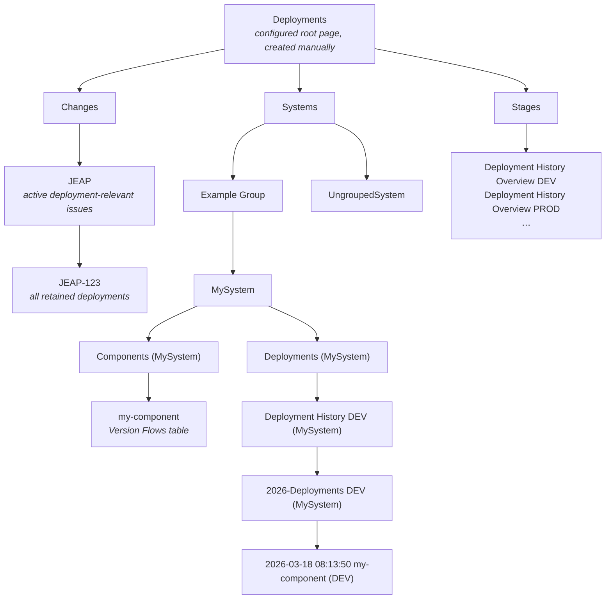
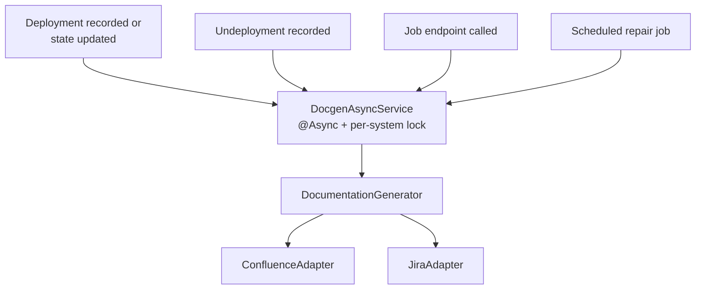

# Documentation Generation

Every recorded deployment is documented as a Confluence page. The Deployment Log Service owns the whole page
tree below the configured root page: it creates, updates, moves and deletes those pages, so manual edits are
overwritten. Restrict the write permission on that tree to the technical user of the service.

## The generated page tree

| Page                          | Title pattern                                       | Content                                                                                                                             |
|-------------------------------|-----------------------------------------------------|---------------------------------------------------------------------------------------------------------------------------------------|
| System page                   | `<SystemName>`                                      | One row per component, one column per environment, showing the deployed version, when it was deployed and a link to the deployment page. Differences between the environments are highlighted, see below. |
| Component page                | `<ComponentName> (<SystemName>)`, below `Components (<SystemName>)` | The latest version flows of one component. The system-qualified title avoids collisions with ArchRepo pages in the same Confluence space. The table is rendered directly on this page; no flow or `Version Flows` child pages are created. |
| Jira project page             | `<JiraProjectKey>`, below `Changes`                | Issues with a deployment started during `change-view-activity-period`, their latest deployment and highest successfully reached CODE-deployment stage. |
| Jira issue page               | `<JiraIssueKey>`, below its Jira project page      | All retained deployments referencing the issue, independent of the project-page activity period. |
| Deployment history            | `Deployment History <ENV> (<SystemName>)`           | The most recent deployments of one system onto one environment, at most `deployment-history-max-show`.                              |
| Deployment list               | `<year>-Deployments <ENV> (<SystemName>)`           | Container page grouping the deployment pages of one year; the deployment pages are its children.                                     |
| Deployment page               | `<yyyy-MM-dd HH:mm:ss> <componentName> (<ENV>)`     | One deployment in detail, see below.                                                                                                |
| Undeployment page             | same, plus the suffix ` (Undeploy)`                 | The removal of a component from an environment.                                                                                     |
| System group                  | `<SystemGroupName>`, below `Systems`                 | A structural page generated only while at least one system belongs to the group.                                                     |
| Components container          | `Components (<SystemName>)`, below the system page   | Parent of the generated component pages; the system overview itself remains on the system page.                                     |
| Deployments container         | `Deployments (<SystemName>)`, below the system page    | Parent of the system's environment, year and deployment hierarchy.                                                                  |
| Deployment history overview   | `Deployment History Overview <ENV>`, directly below `Stages` | The recent deployments of **all** systems onto one environment, limited to `deployment-history-overview-max-time` and `deployment-history-max-show`. |

Only the `Deployments` root page is created manually and configured through `root-page-id`; the generator does
not create another page named `Deployments` below it. Everything else is generated. Grouped systems are placed
directly below their non-empty group page, while ungrouped systems are placed directly below `Systems`. The pages
are rendered from Thymeleaf templates in `jeap-deploymentlog-docgen`
(`template/documentation/`) into the Confluence storage format, in German.

### System page highlighting

On the system page the version cells are coloured so that a drift between the stages stands out. Only
non-development environments are considered — a development environment usually carries snapshot versions
that would make every row look inconsistent.

| Colour | Meaning                                                                                  |
|--------|--------------------------------------------------------------------------------------------|
| Green  | The component has the same version on all non-development environments.                    |
| Yellow | The next stage carries a *lower* version than this one.                                    |
| Blue   | The next stage has no version of this component at all.                                    |
| None   | Nothing to report for this cell.                                                           |

The order of the stages follows the `staging_order` column of the environment.

### Component page and version flows

One page is generated per known component directly below the `Components (<SystemName>)` container. Its identity is
the technical component UUID, not its title: the component UUID, Confluence page id and current parent page id are
persisted together. This keeps the page id and Confluence history stable when a component changes systems. Moving a
system between groups needs no component-page operation because the complete system subtree moves with it.

The component page shows the latest flows ordered by `bornAt` descending and flow id descending as a deterministic
tie-breaker. `component-flow-max-show` limits only this Confluence view; flow rows are never deleted. Each row contains
the version, start time, stable flow type (`NEW`, `RETRY`, `ROLLBACK` or `AD_HOC`) and state, effective target stage,
Jira issues and all deployment attempts in reverse chronological order with stage and state icons. `ABORTED` and `AD_HOC`
rows are highlighted. Existing deployment pages are linked through a stable URL containing their persisted page id;
a later regeneration adds links that were unavailable during an earlier partial run. Jira keys come exclusively from
the persisted deployment changelogs, are deduplicated and sorted, and are turned into ordinary links using the
configured Jira base URL. Rendering never performs a live Jira request.

Only a `CLOSED` flow shows its successful duration, measured from `bornAt` to the completion timestamp of the
successful target-stage deployment. `OPEN` and `ABORTED` show no successful duration. Negative durations are treated
as inconsistent data, logged and omitted.

### Jira project pages

For each Jira project with an active issue, one project page is generated directly below `Changes`. Issue keys come
from persisted deployment changelogs, are trimmed, upper-cased, validated, deduplicated and grouped by their project
prefix. Invalid keys remain unchanged in the deployment data but are logged and skipped. Activity means that at least
one associated deployment has `startedAt` within `change-view-activity-period` (30 days by default); it is a view
filter and never deletes deployment, changelog or page-tracking data.
If a previously relevant project no longer has active issues, a full or system regeneration clears its active-issue
table but retains the tracked project page so that existing issue pages and stable Confluence page ids are preserved.

The deployment status uses CODE deployments only. It shows the environment with the greatest `staging_order` on
which the issue has a successful deployment, or `N/A`; a failed attempt on a higher environment is shown separately.
Issues without a successful deployment on a productive environment are ordered first, followed by the newest
associated deployment and the normalized issue key as deterministic tie-breakers. Jira links are constructed from
the configured Jira URL, without reading Jira. If a tracked DeploymentLog issue page exists, the project page also
links it by its stable Confluence page id.

### Jira issue pages

Each active issue has at most one generated page below its project page. Its normalized Issue Key is the persistent
identity; the Project Key, Confluence Page ID and current parent Page ID are tracked only after Confluence succeeds.
Tracked pages are updated and moved by Page ID, and missing pages are recreated idempotently.

The page lists every retained deployment whose changelog references the issue, not only deployments inside the
project-page activity period. CODE, CONFIG and INFRASTRUCTURE deployments are sorted by `startedAt` descending with
external deployment id and database id as deterministic tie-breakers. Each row shows time, environment, system,
component, version, all deployment types, status icon and text, the starter and, when available, a stable Page-ID
link to the deployment page. Missing deployment pages produce no broken link and are linked on a later regeneration.
The Jira issue link is constructed from the configured Jira URL; rendering performs no Jira read.

### Deployment page content

A deployment page documents one deployment: the environment and the deployment target, who started it and
when, the state with its message and the resulting duration, the deployment sequence (first deployment, new
version, repetition, undeployment), the component version with a link to the deployed source state, the
deployment unit with its coordinates and artefact repository, the deployment types, the links and the
properties sent with the deployment, the Remedy change id (as a link when a Remedy root URL is configured),
the build job links resolved from the published artifact versions and references, and the changelog with its
Jira issue keys.

## When pages are generated

Generating the pages for one deployment first reconciles the structural pages, then walks the deployment path —
the grouped or ungrouped system page, its `Deployments (<SystemName>)` container, the environment history page, the year page,
the global environment overview and finally the deployment or undeployment page. The affected component page is then
rendered from the committed flow and deployment state. Jira project pages referenced by that deployment are updated
under `Changes`. All ancestor pages are therefore refreshed with the same run,
which is why recording a deployment also keeps the aggregated views current.

Every step is idempotent. Stable Confluence page ids and their expected parents are persisted. Existing pages are
updated or moved by id, preserving their content, children and Confluence history; a missing tracked page is created
again. Global environment overview pages below the legacy `_Deployment History Overview` or
`Stages / Deployment History` intermediate page are moved directly below `Stages` by their stable ids; the obsolete
intermediate page is then deleted.

The service remembers which Confluence page belongs to which deployment and component (and to which system,
environment and year), together with the deployment state timestamp the page was rendered from. That record is what
makes it possible to detect pages that are missing or out of date and to repair them later, and to move the
pages when a system is renamed or merged.

### Concurrency and conflicts

Two safeguards keep concurrent runs from corrupting the tree:

- A **per-system lock** (ShedLock, `docgen-<systemname>`) serialises all generation runs for one system
  across all service instances. A run that cannot acquire the lock within three minutes gives up and leaves
  the work to the scheduled repair job.
- Structure reconciliation uses the dedicated global ShedLock `docgen-documentation-structure` around a short,
  independent transaction. This prevents jobs for different systems from concurrently creating the same structure
  tracking record without serialising their subsequent system-specific page generation.
- Component-page creation additionally locks the component database row. This serialises the title lookup, Confluence
  operation and tracking update across service instances even during a component move. Tracking is written only after
  Confluence has successfully created, updated or moved the page.
- Jira project-page generation locks the persisted `Changes` structure row. This serialises project title lookup,
  Confluence operations and tracking across different system locks and service instances; a project Page ID is stored
  only after Confluence succeeds.
- When Confluence rejects an update because the page was modified concurrently (HTTP 409), the adapter
  waits `retry-on-conflict-wait-duration` (a constant wait, 10 seconds by default), re-reads the page and
  **re-renders** the content from the current state before retrying. Writing an already rendered snapshot
  would silently discard the concurrent change. One call makes up to three such update attempts.
  On top of that, every Confluence request is retried up to four times with exponential backoff (2 seconds,
  doubling). Both retries nest: a conflict that never resolves therefore causes up to twelve update requests,
  with the constant conflict wait and the exponential backoff alternating in between.

## Jira integration

After a DeploymentLog issue page has been generated, the service writes one stable remote link ("mentioned in") from
the Jira issue to that page. Its `globalId` is built from the configured `app-id` and normalized Issue Key, not the
Confluence Page ID. Repeated content updates therefore reuse the link, while recreating a missing Confluence page
updates its URL.

Failures are retried by the Jira client, then logged and counted without rolling back valid page tracking or failing
the deployment request. A later page generation retries the link, and
`POST /api/jobs/docgen/system/{systemName}/repairJiraLinks` repairs stable links for already tracked issue pages in a
date range, see [REST API](rest-api.md#jobs).

New deployments no longer create remote links to their individual deployment pages. Links created by older versions
are deliberately not deleted and remain visible in Jira; this avoids destructive migration calls to Jira.

The Jira links shown in the component flow table are independent of this write-back operation. They use stored issue
keys and the configured Jira URL, so the component page can be rendered while Jira is unavailable.

Note that this is separate from the [ready-for-deploy check](rest-api.md#ready-for-deploy-check), which
happens synchronously *before* a deployment is recorded.

## Renaming and merging systems

Because the page tree is keyed by the system name, renaming or merging a system has to move the existing
pages:

- **Rename** (`POST /api/system/{oldSystemName}/migrate-to/{newSystemName}`) — the existing system page is renamed
  by its stable page id and moved to its current group target if necessary. Its `Components (<SystemName>)`,
  `Deployments (<SystemName>)`,
  environment, year and deployment descendants are retained.
- **Merge** (`POST /api/system/{systemName}/merge-from/{oldSystemName}`) — the deployment pages of the old
  system are moved into the grouped or ungrouped tree of the target system, and only the obsolete source system's
  page tree and page records are deleted.

Both run asynchronously under the per-system lock.

## Local development

Set `mock-confluence-client: true` and `mock-jira-client: true` to run an instance without touching
Confluence or Jira at all; the generation then runs against mock adapters. See
[Configuration](configuration.md).

## Related

- [Architecture](architecture.md)
- [Configuration](configuration.md)
- [Operations](operations.md)
- [REST API](rest-api.md)
