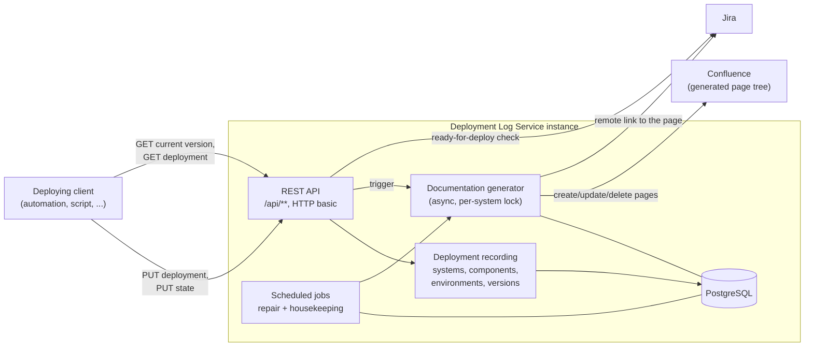

# Getting Started

This guide describes how to set up an own instance of the Deployment Log Service. For the property
reference see [Configuration](configuration.md), for the endpoints see [REST API](rest-api.md), and for
the generated Confluence pages see [Documentation Generation](documentation-generation.md).

## How it works

The Deployment Log records every deployment of a component onto an environment. A deployment is announced
by a `PUT` on the deployment resource, and its outcome is reported by a second `PUT` on the state
sub-resource. From the recorded data the service maintains two things: the current state of all
environments in its database, and a tree of generated Confluence pages documenting the deployments.



The service is request-driven: it has no messaging integration and never initiates a deployment. Page
generation runs asynchronously after the request has been answered, so a Confluence or Jira outage never
fails the recording of a deployment — see [Operations](operations.md).

## 1. Create a service instance

This repository is published as a **library**. Every organisation, programme or system creates its own
instance, i.e. a source code repository containing a POM referencing the library and the configuration
files (`application-<env>.yml`). No Java code is required.

If the instance is not part of a multi-module project, use `jeap-deploymentlog-service-instance` directly
as the Maven parent. It brings in `jeap-deploymentlog-web` and therefore needs no explicit dependency:

```xml
<parent>
    <groupId>ch.admin.bit.jeap</groupId>
    <artifactId>jeap-deploymentlog-service-instance</artifactId>
    <version>use-the-latest-version-here</version>
    <relativePath/>
</parent>
```

Inside a multi-module project, declare the dependency explicitly instead:

```xml
<dependency>
    <groupId>ch.admin.bit.jeap</groupId>
    <artifactId>jeap-deploymentlog-web</artifactId>
    <version>${jeap-deploymentlog-service.version}</version>
</dependency>
```

> In multi-module projects, make sure the `jeap-spring-boot-parent` version used by your parent matches
> the one used by the Deployment Log dependencies.

The main class of the application is `ch.admin.bit.jeap.deploymentlog.web.DeploymentLogApplication`. All
beans of the library — controllers, security, repositories, the documentation generator and the Jira
client — are contributed by auto-configuration (`DeploymentLogConfig`, `PersistenceConfiguration`,
`DomainConfiguration`, `DocumentationGeneratorConfig`, `JiraWebClientConfig`), so an instance with its own
`@SpringBootApplication` class picks them up as well.

## 2. Order the technical user

Page generation and the Jira integration are performed with **one technical user** that needs:

- write permission on the Confluence space the documentation is generated into,
- browse permission on the Jira projects whose issues are referenced by deployments, and permission to
  add remote links to their issues.

The same credentials are used for both systems if Confluence and Jira share the user directory; otherwise
configure them separately under `jeap.deploymentlog.documentation-generator.confluence` and
`jeap.deploymentlog.jira`.

## 3. Prepare the Confluence root page

The documentation is generated **below an existing Confluence page** that has to be created manually once.
Note its page id — it is configured as `root-page-id`. Restrict the write permissions on that page tree to
the technical user: everything below it is generated, and manual changes are overwritten or removed.

## 4. Prepare the database

The service requires a **PostgreSQL** database. The schema is created and migrated by Flyway at startup
from the migrations bundled in `jeap-deploymentlog-persistence` (`db/migration`), using the default
`spring.flyway.locations`. Flyway is enabled by default, so only the datasource has to be configured:

```yaml
spring:
  datasource:
    url: jdbc:postgresql://db-host:5432/deploymentlog
    username: ${DB_USERNAME}
    password: ${DB_PASSWORD}
```

The library ships defaults for the JPA/Hikari/Flyway settings in `deploymentlogDefaultProperties.properties`
(PostgreSQL dialect, `ddl-auto: none`, `open-in-view: false`), so these must not be set again.

## 5. Configure the application

A minimal configuration of an instance looks as follows:

```yaml
spring:
  application:
    name: my-deploymentlog-service
  datasource:
    url: jdbc:postgresql://db-host:5432/deploymentlog
    username: ${DB_USERNAME}
    password: ${DB_PASSWORD}

jeap:
  deploymentlog:
    # Prefix a confluence page id is appended to, used for the /api/deployment-doc redirect
    # and for the remote links written into jira issues
    documentation:
      root-url: "https://confluence.example.com/pages/viewpage.action?pageId="
    documentation-generator:
      confluence:
        url: "https://confluence.example.com"
        space-key: "MYSPACE"
        root-page-id: "123456789"
        username: ${CONFLUENCE_USERNAME}
        password: ${CONFLUENCE_PASSWORD}
      scheduled:
        cron: "0 0/10 * * * *"
      housekeeping:
        cron: "0 30 3 * * *"
    jira:
      url: "https://jira.example.com"
      app-id: ${JIRA_CONFLUENCE_APP_ID}
      username: ${JIRA_USERNAME}
      password: ${JIRA_PASSWORD}
    read-user:
      username: "read"
      password: ${READ_USER_PASSWORD}   # e.g. {bcrypt}$2a$10$...
    write-user:
      username: "write"
      password: ${WRITE_USER_PASSWORD}
```

See [Configuration](configuration.md) for the complete property reference, including the defaults and the
mock clients used for local development.

## 6. Set up the API users

The `/api/**` endpoints are secured with HTTP basic authentication against two in-memory users that are
defined by configuration — there is no user directory and no OAuth2 login for the API:

| User                                    | Role                   | May                                                   |
|-----------------------------------------|------------------------|-------------------------------------------------------|
| `jeap.deploymentlog.read-user.*`        | `deploymentlog-read`   | read deployments, systems and environments            |
| `jeap.deploymentlog.write-user.*`       | `deploymentlog-write`  | everything the read user may, plus record deployments, run jobs and create blog posts |

The passwords are stored in the Spring Security password-encoder format, i.e. prefixed with the encoder id
(`{bcrypt}…`, or `{noop}…` for local development only). The built-in defaults (`read`/`write` with
`{noop}secret`) are meant for tests and **must** be overridden in every real deployment.

Give the write credentials to whatever records the deployments, and the read credentials to consumers that
only query the current state of an environment.

## 7. Record the first deployment

Deployments, systems, components and environments are created on the fly — nothing has to be registered
in advance. Announcing a deployment and reporting its outcome are two calls:

```bash
# 1. Announce the deployment (id is a client-chosen external id, unique per deployment)
curl -u write:secret -X PUT \
  "https://my-deploymentlog/api/deployment/my-component-dev-192" \
  -H 'Content-Type: application/json' -d '{
    "startedAt": "2026-03-18T08:13:50+01:00",
    "startedBy": "deployment automation",
    "environmentName": "DEV",
    "componentVersion": {
      "versionName": "1.15.2",
      "taggedAt": "2026-03-18T07:48:05+01:00",
      "versionControlUrl": "https://git.example.com/my-component/commits?until=79b5557",
      "commitRef": "79b5557",
      "commitedAt": "2026-03-18T07:48:05+01:00",
      "publishedVersion": true,
      "componentName": "my-component",
      "systemName": "MySystem"
    },
    "deploymentUnit": {
      "type": "DOCKER_IMAGE",
      "coordinates": "my-component:1.15.2",
      "artifactRepositoryUrl": "https://registry.example.com"
    }
  }'

# 2. Report the outcome
curl -u write:secret -X PUT \
  "https://my-deploymentlog/api/deployment/my-component-dev-192/state" \
  -H 'Content-Type: application/json' \
  -d '{"timestamp": "2026-03-18T08:16:15+01:00", "state": "SUCCESS", "message": ""}'
```

## 8. Verify the setup

1. `GET /api/deployment/my-component-dev-192` with the read credentials returns the recorded deployment
   including its state.
2. `GET /api/system/MySystem` returns the component with its version per environment.
3. `GET /api/system/MySystem/component/my-component/currentVersion/DEV` returns `1.15.2` as `text/plain`.
4. The Confluence root page now has a child page named after the system, containing the deployment history
   and the deployment page — see [Documentation Generation](documentation-generation.md) for the page tree.
5. `GET /api/deployment-doc/my-component-dev-192` redirects (`302`) to that generated page. This endpoint
   is intentionally unauthenticated so that the link can be handed out freely.

If the pages do not appear, check the log for docgen warnings and the
`deploymentlog.docgen.deploymentpages.error` metric; the scheduled repair job retries failed generations,
see [Operations](operations.md).

## 9. Optional steps

- **Ready-for-deploy check** — let the deploying client pass `?readyForDeployCheck=true` and a changelog
  with Jira issue keys to have the service verify the issues before recording the deployment, see
  [REST API](rest-api.md#ready-for-deploy-check).
- **Swagger UI** — the instance depends on `jeap-spring-boot-swagger-starter`; set `jeap.swagger.status`
  to make the UI available, see [REST API](rest-api.md#openapi-and-swagger).
- **Build job links** — publish artifact versions or references so that the generated deployment pages
  link back to the build that produced the artifact, see [REST API](rest-api.md#artifact-versions-and-references).
- **Remedy change links** — set `jeap.deploymentlog.documentation-generator.config.remedy-change-link-root-url`
  to turn the `remedyChangeId` of a deployment into a link on the generated page.

## Related

- [Architecture](architecture.md)
- [Configuration](configuration.md)
- [REST API](rest-api.md)
- [Documentation Generation](documentation-generation.md)
- [Operations](operations.md)
